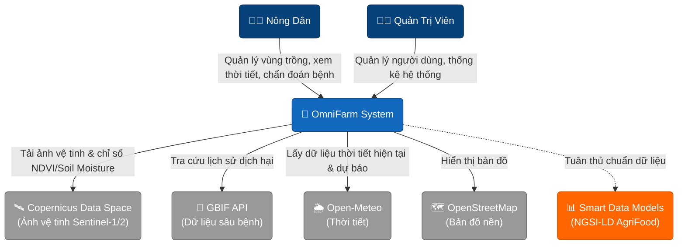
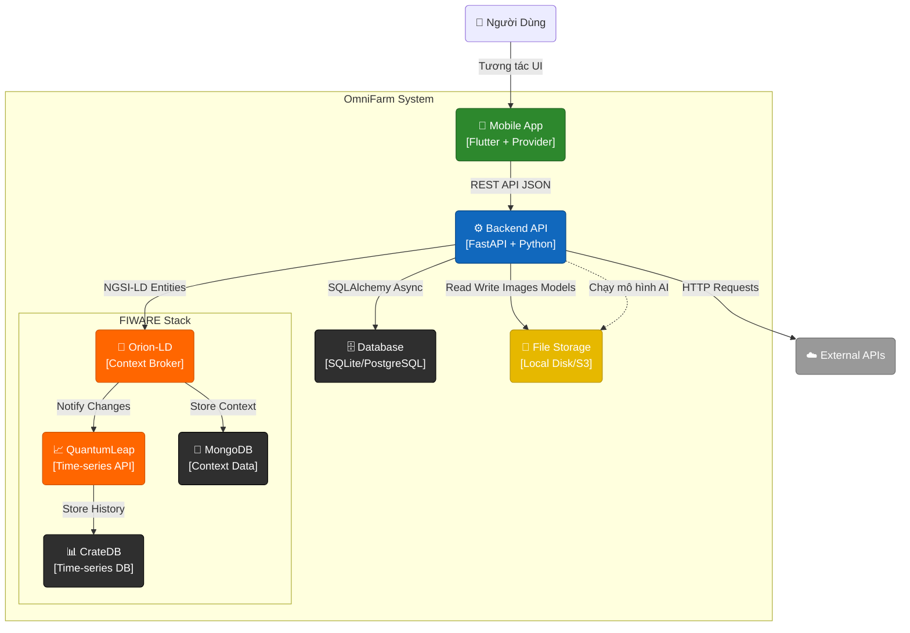
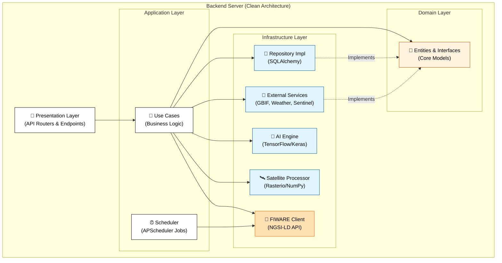

# 🌾 OmniFarm - Nền Tảng Nông Nghiệp Thông Minh Toàn Diện


> **OmniFarm** là giải pháp tiên phong ứng dụng **Trí tuệ nhân tạo (AI)**, **Công nghệ viễn thám (Remote Sensing)**, và **Hệ sinh thái IoT Châu Âu (FIWARE)** vào quản lý nông nghiệp quy mô lớn. 

Được thiết kế để giải quyết bài toán thiếu đồng bộ dữ liệu và giám sát thủ công, OmniFarm mang đến một "bộ não trung tâm" giúp các hợp tác xã và chủ trang trại tối ưu hóa năng suất, giảm thiểu rủi ro dịch bệnh và đưa ra quyết định dựa trên dữ liệu thực tế (Data-Driven Agriculture).

---

## 🎯 Bài Toán & Giải Pháp

**Vấn đề:** Nông dân thường canh tác dựa vào kinh nghiệm, thiếu thông tin tổng quan về sức khỏe cây trồng trên diện rộng, và không có công cụ dự báo sớm dịch bệnh. Dữ liệu cảm biến (IoT) bị phân mảnh, khó quản lý tập trung, dẫn đến rủi ro mất mùa và lãng phí tài nguyên.

**Giải pháp của OmniFarm:**
1. 🛰️ **Giám sát diện rộng bằng Vệ tinh:** Tự động kéo dữ liệu từ hệ thống vệ tinh Sentinel-2 (Copernicus) để phân tích chỉ số sức khỏe thảm thực vật (NDVI), giúp bao quát hàng nghìn hecta mà không cần ra đồng.
2. 🤖 **Chẩn đoán bệnh cục bộ bằng AI:** Sử dụng Deep Learning (TensorFlow) nhận diện tức thời các loại bệnh phổ biến qua ảnh chụp từ smartphone của người nông dân.
3. 🔗 **Đồng bộ IoT Chuẩn NGSI-LD:** Tích hợp hệ sinh thái FIWARE (Orion Context Broker, QuantumLeap, CrateDB) để thu thập và chuẩn hóa mọi dữ liệu cảm biến nông nghiệp theo tiêu chuẩn Châu Âu.

---

## 🌟 Tính Năng Cốt Lõi (Core Features)

### 1. 🛰️ Vệ Tinh (Satellite Intelligence)
- Phân tích sức khỏe cây trồng (NDVI) định kỳ từ vệ tinh **Sentinel-2**.
- Ước tính độ ẩm đất bề mặt sử dụng dữ liệu radar **Sentinel-1**.
- Nguồn dữ liệu: [Copernicus Data Space Ecosystem](https://dataspace.copernicus.eu/).

### 2. 🦠 AI Chẩn Đoán & Dự Báo (AI Disease & Pest Forecast)
- Sử dụng mô hình **TensorFlow/Keras** để chẩn đoán bệnh cây trồng qua ảnh lá cực nhanh và nhẹ.
- Phân tích dữ liệu lịch sử xuất hiện dịch hại từ **GBIF** kết hợp thời tiết để cảnh báo rủi ro bùng phát.

### 3. 🌐 Quản Lý Chuẩn FIWARE IoT
- Dữ liệu chuẩn hóa theo **NGSI-LD** của ETSI, tương thích với Smart Data Models (`AgriParcel`, `AgriCrop`, `WeatherObserved`).
- Sử dụng **Orion Context Broker** quản lý dữ liệu thời gian thực và **CrateDB** lưu trữ time-series.

### 4. 🌦️ Quản Lý Trang Trại & Thời Tiết
- Vẽ ranh giới lô thửa bằng định vị GPS và **OpenStreetMap**.
- Dự báo thời tiết nông vụ chuyên sâu từ **Open-Meteo**.
- Admin Dashboard quản trị toàn hệ thống.

---

## 🛠️ Công Nghệ & Thư Viện (Tech Stack)

Hệ thống được thiết kế theo **Clean Architecture** ở Backend và kiến trúc Microservices vững chắc.

| Thành phần | Công Nghệ / Thư Viện | Mục Đích |
| :--- | :--- | :--- |
| **Backend** | FastAPI, SQLAlchemy, APScheduler | Web Server & Business Logic |
| **AI/ML** | TensorFlow, Keras | Chẩn đoán bệnh bằng AI |
| **Viễn thám**| Rasterio, NumPy, httpx | Xử lý ảnh vệ tinh GeoTIFF |
| **FIWARE** | Orion-LD, QuantumLeap, CrateDB, MongoDB | IoT Platform & Time-series DB |
| **Mobile** | Flutter, Provider, Flutter Map | Ứng dụng di động đa nền tảng |

---

## 🚀 Hướng Dẫn Khởi Chạy Nhanh (Quick Start)

### Chạy bằng Docker (Khuyên dùng)
Cách nhanh nhất để khởi chạy toàn bộ Backend và hệ sinh thái FIWARE:

```bash
# 1. Clone repository
git clone https://github.com/CuongKenn/ICTU-OpenAgri.git
cd ICTU-OpenAgri

# 2. Khởi chạy toàn bộ hệ thống
docker-compose up --build
```
*Các dịch vụ sẽ có mặt tại:*
- Backend API: `http://localhost:8000` (Docs: `http://localhost:8000/api/docs`)
- Frontend Web: `http://localhost:3000`
- Orion-LD: `http://localhost:1026`
- QuantumLeap: `http://localhost:8668`
- CrateDB Admin UI: `http://localhost:4200`

### Thiết lập Frontend (Mobile App)
Yêu cầu đã cài đặt Flutter SDK:
```bash
cd frontend
flutter pub get
flutter run
```

---

## 🏗️ Kiến Trúc Hệ thống (C4 Model)

Hệ thống được thiết kế theo mô hình **C4 Model** kết hợp với **Clean Architecture**.

### Level 1: System Context (Bối cảnh hệ thống)



### Level 2: Container (Thành phần chứa)



### Level 3: Component (Kiến trúc Backend)



---

## 🤝 Đóng Góp (Contributing)
Chúng tôi rất hoan nghênh mọi đóng góp từ cộng đồng! Mở Pull Request hoặc Issue trên kho lưu trữ.

## 📄 Giấy Phép (License)
Dự án này được phân phối dưới giấy phép **MIT License**. Xem file `LICENSE` để biết thêm chi tiết.

## 📞 Liên Hệ
- **Tác giả**: CuongKenn
- **GitHub**: [https://github.com/CuongKenn/ICTU-OpenAgri](https://github.com/CuongKenn/ICTU-OpenAgri)

---
*Phát triển với ❤️ vì nền nông nghiệp số hiện đại.*
